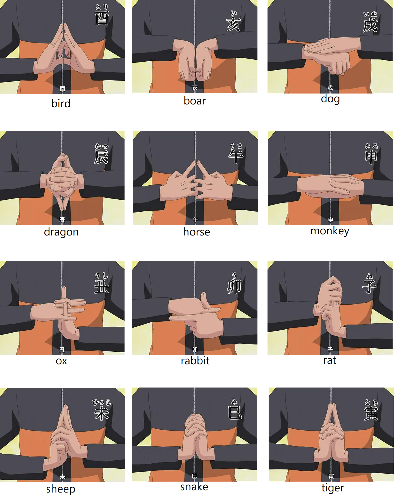

# Ninja Mudras Recognizer

## Prepare mudras video

Reference to `MudrasList.png`  

make an video(1280x720) for each mudra about 20 sec.  
Make sure move your hand in 4:3 region, keep changing the degree, position and distance.  

Rename the video followed by `MudrasList.png`, and put it into `preprocessing/Split_Video/videos/`.  
If the original resolution of video is 1280x720, double click `720P-16.9-to4.3.cmd` first, if 4:3 go below.  
Then double click `split.cmd` if you run on Windows, it will split the video frame and throw them to `source_data/images/<label>`.  
`<label>` is decided by video name, so please make sure you set the corrospond filename.  

## Environment

I run this project on Win10, and make several script(.cmd/.ps1) for convenience  
but it should be easily porting to Linux by few change.  

If you run on Win10, install Python 3.7 (with py launcher) first, please double click `venv/SetEnv.cmd`. It could easily create the virtualenv with package requirements.  

Other platform please reference to `venv/package_requirements.txt`.  

## Run

`01_copy_images_to_dataset.py` for importing images randomly into workspace.  
`02_train.py` for training recognizer.  
`03_test.py` for testing by `workspace/datasets/test`.  
`04_recognizer.py` for recognizing single images.  
`05_stream_detect.py` for continuous recognizing stream frame from webcam.  
